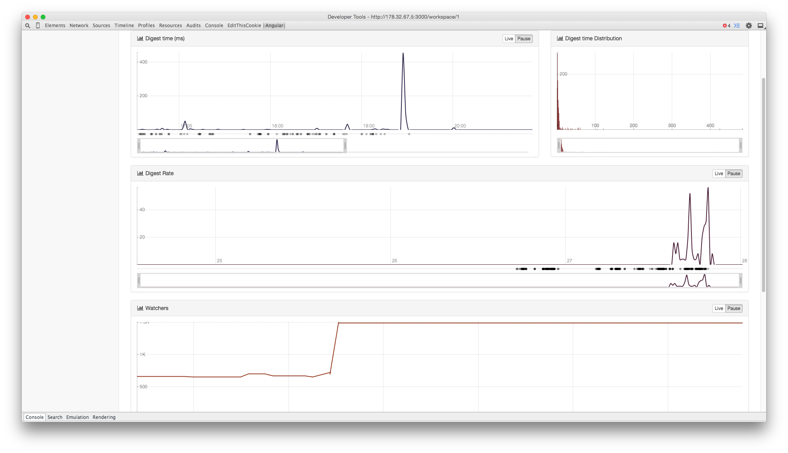

#Angular-performance

[](https://www.codacy.com/app/nikel092_2742/angular-performance)
[](https://david-dm.org/Linkurious/angular-performance)
[](http://inch-ci.org/github/Linkurious/angular-performance)

[](screenshot.png)

This is a chrome extension aimed at monitoring angular application performance.
Tested with: angular 1.2.28 and 1.3.15

Because of how Angular 1.x is structured, some key elements needs to be monitored during developement to assess an application performance. This extension provides realtime monitoring charts of the number of watchers, digest timing and digest rate. You also get the digest timing distribution so that you can make out exceptionally long digest timing from more recursive paterns and all realtime data are linked to events so that you can determine which actions changed the application performances. Finally, you can time services method and count their execution to determine the ones that have the more impact on the running time of your app. 

## Install
###From the Chrome Web Store
[WebStore Link](https://chrome.google.com/webstore/detail/angular-performance/hejbpbhdhhchmmcgmccpnngfedalkmkm)

### Manual
* Clone the repository
* **(Optional)** Switch to the develop git branch (Latest version)
* Build the extension (see below)
* Go into the Chrome main menu -> more tools -> extension 
* Enable developer mode
* Load unpacked extension
* select the `extension` folder of this repository


## Build
### Requirements
* Node
* Npm
* Chrome > v41

### Commands

To build the extension you have to run a few commands

```shell
$ npm install
$ npm run build
```

## Features

### Implemented
* Events Capture
* Digest time monitoring
* Digest rate monitoring
* Digest times distribution
* Watcher count monitoring
* Services async and sync timing

### Roadmap
* FPS rendering monitoring
* Scopes inspection (respective value and digesting time)
* Dependency analysis
* Back up collected data on a remote server

## License
See [LICENSE](LICENSE) file.

## Credits
Many thanks to the contributors on these open source projects on which is inspired this extension
* [ng-stats](https://github.com/kentcdodds/ng-stats)
* [Angular Inspector](https://github.com/kkirsche/angularjs-inspector)
* [ng-Inspector](https://github.com/rev087/ng-inspector)

